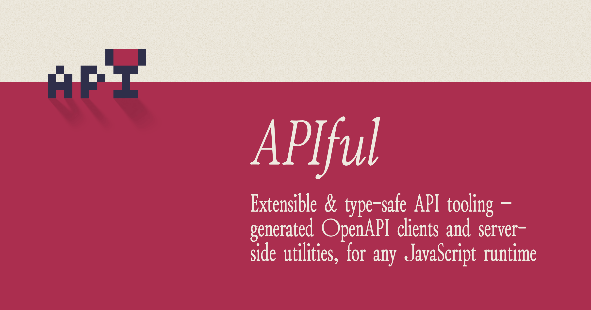

[](https://apiful.byjohann.dev)

# APIful

[![npm version][npm-version-src]][npm-version-href]
[![bundle][bundle-src]][bundle-href]

APIful provides a unified interface to manage all your API interactions by setting up a client with default fetch options, such as the base API URL and headers. Extensions add a variety of features to the client to match your favorite flavor of API management.

You can use one of the [built-in extensions](https://apiful.byjohann.dev/guide/using-extensions#built-in-extensions) to get started right away, or create your own [custom extension](https://apiful.byjohann.dev/guide/custom-extensions) to meet your specific needs.

## Setup

> [!TIP]
> [📖 Read the documentation](https://apiful.byjohann.dev)

```bash
# pnpm
pnpm add -D apiful

# npm
npm i -D apiful
```

## Usage

> [!TIP]
> [📖 Read the documentation](https://apiful.byjohann.dev)

### Your First API Client

Create your first API client by initialising it with a base URL and a sample bearer token for authorization:

```ts
import { createClient } from 'apiful'

const baseURL = '<your-api-base-url>'
const client = createClient({
  baseURL,
  headers: {
    Authorization: `Bearer ${process.env.API_KEY}`,
  },
})
```

> [!NOTE]
> The `createClient` function returns an [`ApiClient`](https://apiful.byjohann.dev/reference/api-client) instance that does not yet have a call signature. You will need to add a base extension to the client in order to make API requests. Read on to learn how to do this.

### Built-in Extensions

<table><tr><td width="500px" valign="top">

### `ofetchBuilder`

```ts
import { createClient, ofetchBuilder } from 'apiful'

const baseURL = '<your-api-base-url>'
const adapter = ofetchBuilder()
const api = createClient({ baseURL }).with(adapter)

// GET request to <baseURL>/users/1
await api('users/1', { method: 'GET' })
```

</td><td width="500px"><br>

**What it does:**

The `ofetchBuilder` wraps [ofetch](https://github.com/unjs/ofetch) to handle API requests.

</td></tr><tr><td width="500px" valign="top">

### `apiRouterBuilder`

```ts
import { apiRouterBuilder, createClient } from 'apiful'

const baseURL = '<your-api-base-url>'
const adapter = apiRouterBuilder()
const api = createClient({ baseURL }).with(adapter)

// GET request to <baseURL>/users/1
await api.users.get(1)
// POST request to <baseURL>/users with payload
await api.users.post({ name: 'foo' })
```

</td><td width="500px"><br>

**What it does:**

The `apiRouterBuilder` provides a jQuery-like and Axios-esque API for building and making API requests. It allows you to construct your API calls in a declarative way.

</td></tr><tr><td width="500px" valign="top">

### `OpenAPIBuilder`

```ts
import { createClient, OpenAPIBuilder } from 'apiful'

const baseURL = 'https://petstore3.swagger.io/api/v3'
// Pass pre-generated schema type ID to adapter
const adapter = OpenAPIBuilder<'petStore'>()
const api = createClient({ baseURL }).with(adapter)

// Typed parameters and response
const response = await api('/user/{username}', {
  method: 'GET',
  path: { username: 'user1' },
})
```

</td><td width="500px"><br>

**What it does:**

If your API has an [OpenAPI](https://swagger.io/resources/open-api/) schema, APIful can use it to generate types for you, which the `OpenAPIBuilder` extension then consumes to provide type-safe API calls.

For example, the response returned by the API call on the left is typed as follows:

```ts
const response: {
  id?: number
  username?: string
  // …
}
```

Follow the [OpenAPI extension documentation](https://apiful.byjohann.dev/extensions/openapi) to learn more about how to generate TypeScript definitions from your OpenAPI schema files.

</td></tr></table>

### Custom Extensions

Each client can have more than one extension. This means that you can chain `with` methods to add multiple extensions to your client.

For example, you can add a custom extension to log the default fetch options:

```ts
import type { MethodsExtensionBuilder } from 'apiful'

const logExtension = (client => ({
  logDefaults() {
    console.log('Default fetch options:', client.defaultOptions)
  }
})) satisfies MethodsExtensionBuilder

const extendedClient = client
  .with(logExtension)

extendedClient.logDefaults() // { baseURL: '<your-base-url>', headers: { Authorization: 'Bearer <your-bearer-token>' } }
```

If you have specific requirements that are not covered by the included extensions, you can create your own extensions. Follow the [Custom Extensions](https://apiful.byjohann.dev/guide/custom-extensions) guide to learn more.

## Development

- Clone this repository
- Install latest LTS version of [Node.js](https://nodejs.org/en/)
- Enable [Corepack](https://github.com/nodejs/corepack) using `corepack enable`
- Install dependencies using `pnpm install`
- Run interactive tests using `pnpm test`

## License

Made with 💛

Published under [MIT License](./LICENSE).

<!-- Badges -->

[npm-version-src]: https://img.shields.io/npm/v/apiful?style=flat
[npm-version-href]: https://npmjs.com/package/apiful
[bundle-src]: https://img.shields.io/bundlephobia/minzip/apiful?style=flat
[bundle-href]: https://bundlephobia.com/result?p=apiful
